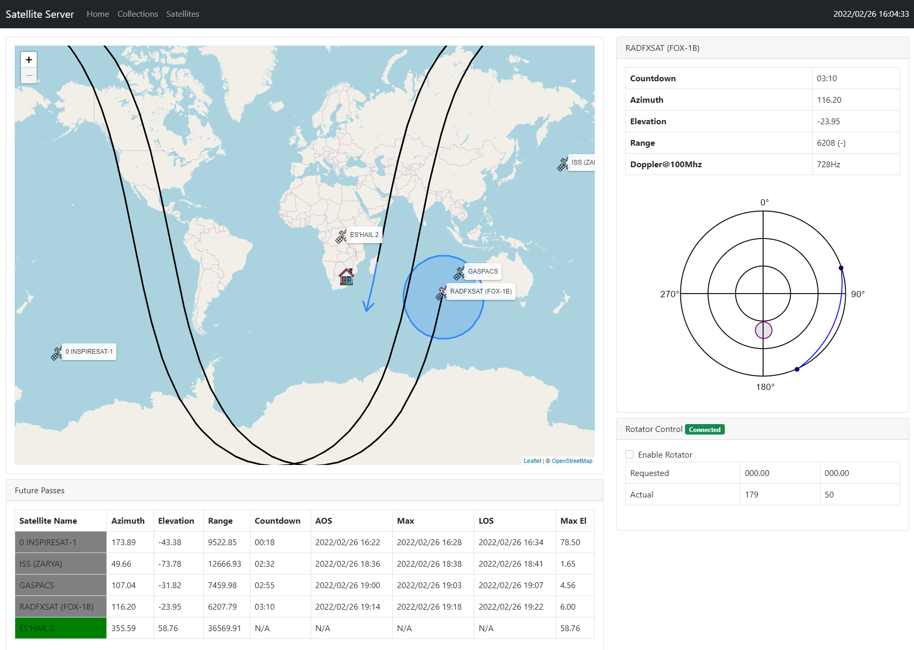

# satellite-server

**Warning: This is still very much a work in progress**

The concept behind the satellite server is to have a central point to do satellite tracking. A raspberry pi acts as the server giving a browser view of satellite tracking. It also provides a central point for management of satellite TLE data.



# Basic Setup Instructions

Use [Raspberry PI Imager](https://www.raspberrypi.com/software/) to flash Raspberry PI OS Lite (tested with 2022-01-28 release)

Once the PI has booted you need to install the following dependencies:

```
sudo apt-get update
sudo apt-get install git
sudo apt-get install python3-pip
sudo apt-get install python3-numpy
```

Next up is cloning this repo and installing the python requirements

```
git clone https://github.com/tomvdb/satellite-server.git
cd satellite-server
pip install -r requirements.txt
```
Create initial database and configure you qth coordinates

```
python db_create.py
nano -w app/config.json
```

You can now start the test server. 

```
python satserver.py
```

# Getting Started

Navigate your browser to http://<your_pi_ip>:8080

To get started you need to add your first satellite. Browse to "Satellites" and click on "Add Satellite". You can now either enter all the details of the satellite into the form, or use the "Query Satnogs DB" section to enter a norad id. (For example the ISS is 25544.

Once you satellite is added you need to add it to a collection. Currently the "Default" Collection is what the main map uses.

Go back to the site home and your satellite will now show. You can select it to get more details and show the orbit and next pass.

# Rotator Control

This is still a work in progress, but essentially I have [Node-Red](https://nodered.org/) installed on the same pi. My flow contains a websocket component that listens for az/el requests. More information on this soon.

# Radio Control

Still working on this bit, but will be similar to rotator control. More information coming on this soon.

# Credit
Polar Chart code is mostly from the [Satnogs System](https://satnogs.org/)

<a href="https://www.flaticon.com/free-icons/satellite" title="satellite icons">Satellite icons created by Freepik - Flaticon</a>
